<!-- markdownlint-configure-file { "MD013": { "line_length": 120 } } -->
<!-- markdownlint-disable-next-line MD033 MD041 -->
<div align="center">


# InstallRS

**A Rust-based framework for building self-contained software installers.**


</div>

Are you tired of wrestling with clunky installer frameworks?
That only compile and run on a developer-unfriendly OS?
That force you to write your installer logic in a 1990's scripting language
without proper flow control and error handling?
That have restrictive licenses and closed-source implementations?
Do you want the full power of Rust's ecosystem at your fingertips?

InstallRS is here to revolutionize the way you create software installers.

> **Note:**
> This project has been written to a large degree with AI coding tools.
> While the author has remained in the loop for design decisions,
> architecture, and testing, the code may reflect the limitations
> of the AI tools used. Contributions to refine and
> improve the codebase are welcome.

## Highlights

- **Write installer logic in plain Rust**, with the full standard
  library and crate ecosystem at your disposal.
- **Self-contained binaries.** Embedded files ship inside a single
  executable via `include_bytes!`, with optional LZMA / gzip / bzip2
  compression and SHA-256 payload integrity verification at startup.
- **Automatic uninstaller.** The CLI generates a matching uninstaller
  binary embedded into the installer; one `install()` + `uninstall()`
  pair in your code covers both.
- **Optional native wizard GUI** — Win32 on Windows (via `winsafe`),
  GTK3 on Linux (via `gtk-rs`) — with welcome, license, components,
  directory picker, install, finish, and error pages, plus custom pages
  for arbitrary inputs. Runs headless when the user passes
  `--headless`, so the same definition serves both modes.
- **Component system** — let users pick optional features via wizard
  checkboxes or `--components` / `--with` / `--without` flags.
- **Progress with meaning.** Step-weighted per component, with both
  one-shot and streaming APIs for custom work.
- **Cancellation built in** — every file op checks a shared flag.
  Cancel button and Ctrl+C both flip it (first press cancels, second
  exits).
- **Windows polish** — automatic PNG-to-ICO conversion, VERSIONINFO,
  UAC manifests, DPI awareness.

## Screenshots

<!-- markdownlint-disable MD033 MD045 -->
<table>
<tr>
<td width="50%">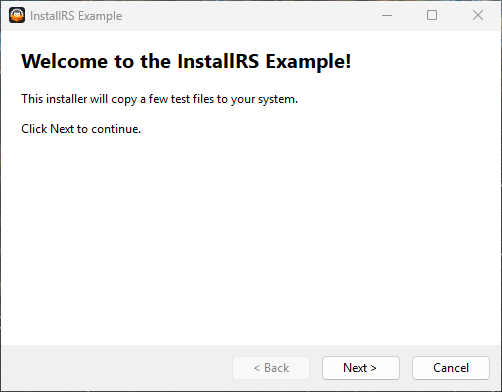</td>
<td width="50%">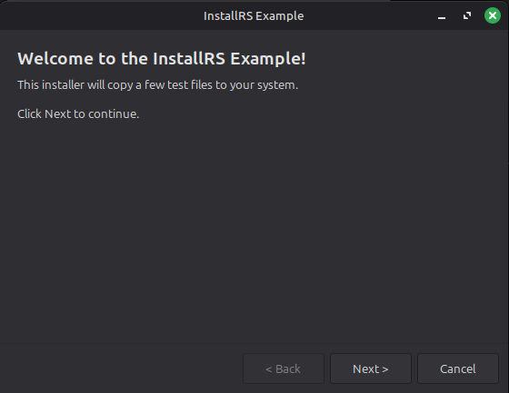</td>
</tr>
<tr>
<td align="center"><sub>Win32 on Windows</sub></td>
<td align="center"><sub>GTK3 on Linux</sub></td>
</tr>
</table>

<details>
<summary>More wizard pages</summary>

| Page        | Windows                                           | Linux                                           |
| ----------- | ------------------------------------------------- | ----------------------------------------------- |
| License     | 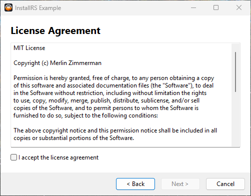    | 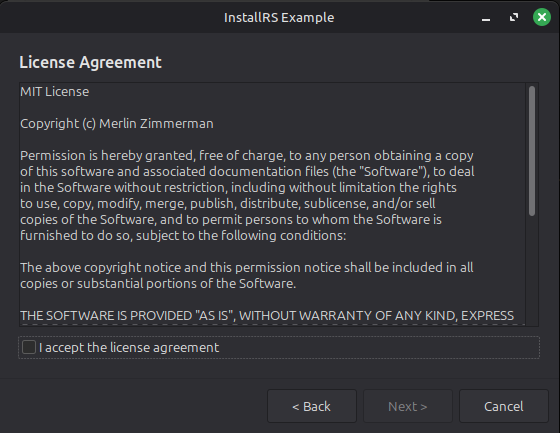    |
| Components  | 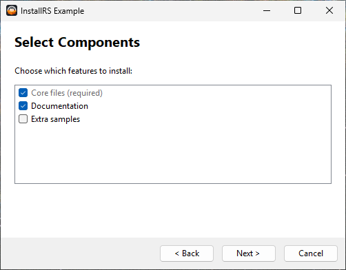 | 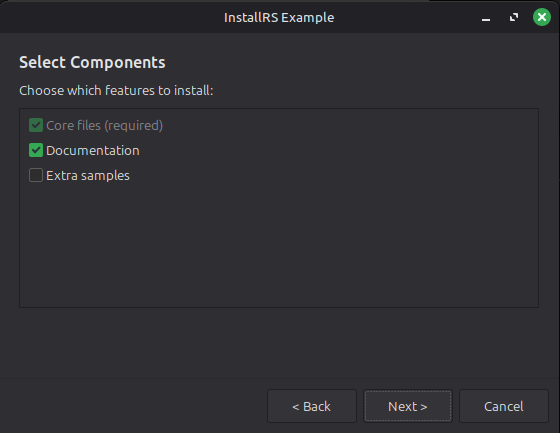 |
| Install dir | 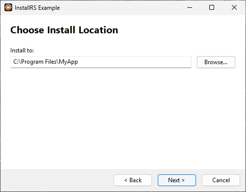 | 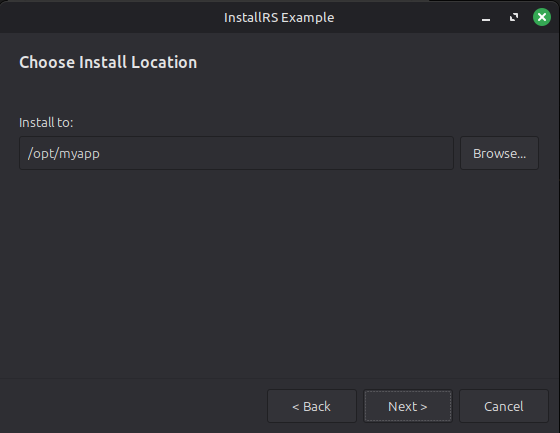 |
| Custom page | 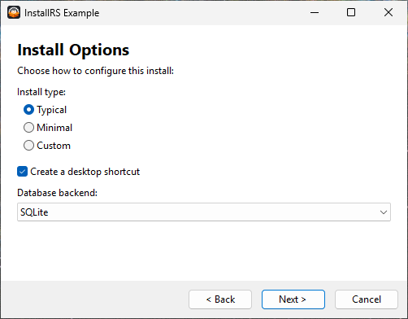     | 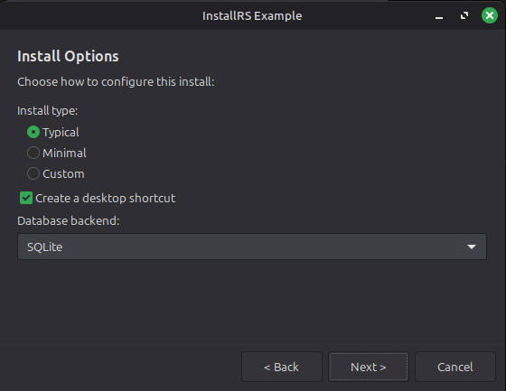     |
| Install     | 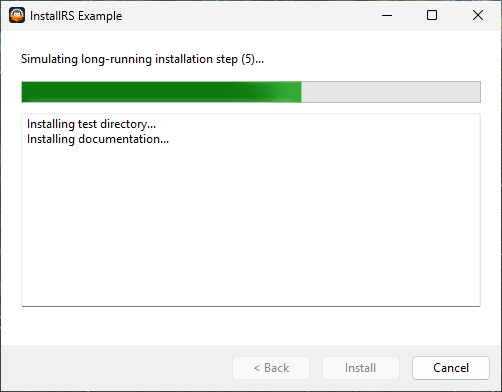    | 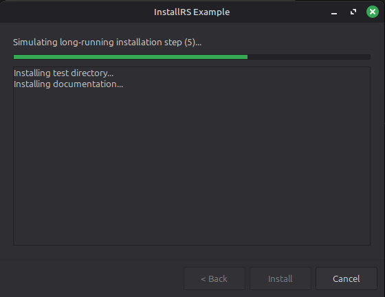    |
| Finish      | 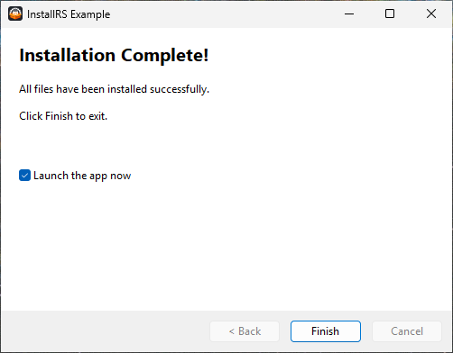     | 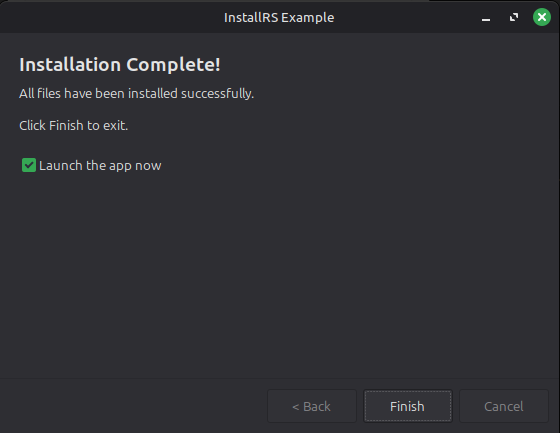     |

</details>
<!-- markdownlint-enable MD033 MD045 -->

## Usage overview

Write a library crate with `install` and `uninstall` functions:

```rust
use anyhow::Result;
use installrs::{source, Installer};

pub fn install(i: &mut Installer) -> Result<()> {
    i.process_commandline()?;
    i.set_out_dir("C:/my_app");
    i.dir(source!("assets"), "assets").install()?;
    i.file(source!("app.exe"), "app.exe").install()?;
    i.uninstaller("uninstall.exe").install()?;
    Ok(())
}

pub fn uninstall(i: &mut Installer) -> Result<()> {
    i.process_commandline()?;
    i.remove("C:/my_app").install()?;
    Ok(())
}
```

Then build with the `installrs` CLI:

```sh
installrs build --target ./my-installer --output installer.exe
```

The repo's [`example/`](example) directory is a complete working
installer demonstrating GUI, components, translations, custom pages,
and headless mode — the best way to see the whole system in action.

## Documentation

- [Getting Started](docs/getting-started.md) — zero-to-first-installer walkthrough.
- [Builder CLI reference](docs/builder-cli.md) — `installrs` command flags and env variables.
- [Building for production](docs/building.md) — cross-compilation, size and speed tuning,
  reproducibility, code signing, release CI.
- [Embedded files, builder ops, and progress](docs/embedded-files.md) — the `source!` macro,
  the fluent `file` / `dir` / `remove` / `shortcut` / `registry` / `step` API, and the progress model.
- [GUI Wizard](docs/gui-wizard.md) — wizard builder, custom pages, dialogs, headless mode.
- [Installer API](docs/installer-api.md) — selectable components plus custom `--flags`.
- [Internationalization](docs/internationalization.md) — translating wizard strings,
  locale detection, and the pre-wizard language picker.
- [Windows Resources](docs/windows-resources.md) — icons, version info, UAC manifests.
- [Architecture](docs/architecture.md) — how the codebase is organized
  and what the generated installer crates look like.
- [API reference on docs.rs](https://docs.rs/installrs) — every public type and method.
- [Changelog](CHANGELOG.md) — release history.

## Requirements

- Rust toolchain (stable)
- The `installrs` CLI, which you can install with `cargo install installrs`.
- (Linux GUI builds) GTK3 dev headers: `libgtk-3-dev` on Debian/Ubuntu, `gtk3-devel` on Fedora/RHEL.
- The target crate must be a library crate exporting `install` and `uninstall`

## License

This project is licensed under the MIT License.
See the [LICENSE.txt](LICENSE.txt) file for details.

## Contributing

Contributions are welcome! Please feel free to submit issues and pull requests.
